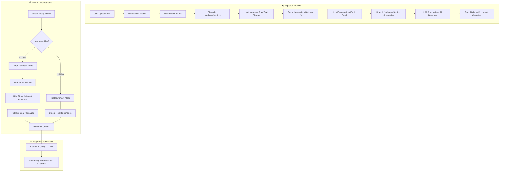

# Vectorless RAG

> A **document Q&A system** powered by LLM Tree RAG — no vector embeddings, no external vector databases. Upload documents, and ask questions grounded in source passages using a hierarchical summary tree for retrieval.

## 🎬 Demo

<video src="https://github.com/praful-1812/vectorless-rag/raw/main/demo.mov" controls width="100%"></video>

> *Upload files, ask questions, get cited answers — all running locally with Ollama.*

---

## ✨ Features

### 📄 Document Management
- **Multi-file upload** — drag & drop up to 10 files at once with batch progress tracking
- **Wide format support** — PDF, DOCX, XLSX, PPTX, HTML, CSV, JSON, XML, images, audio
- **Graceful fallbacks** — unsupported/binary files get metadata entries instead of crashing
- **File content viewer** — click any file to inspect its parsed markdown content
- **Select All / deselect** — quickly choose which files to include in your query

### 🧠 LLM Tree RAG (No Vectors!)
- **Zero vector embeddings** — uses hierarchical LLM summarization instead of embedding models
- **Automatic tree building** — ingested files are chunked and organized into a summary tree
- **Smart retrieval** — LLM traverses the tree top-down to find relevant passages
- **Adaptive strategy** — uses root summaries for broad queries (>5 files), deep traversal for focused ones
- **Source citations** — every answer comes with passage references you can trace back

### 💬 Chat Interface
- **Streaming responses** — real-time token-by-token output with progress indicators
- **Progress stages** — see "Searching files..." → "Generating response..." live
- **Multi-session** — create, switch, and delete chat sessions
- **Welcome page** — quick-start buttons for common queries
- **File-scoped queries** — select specific files to narrow the search

### 🔌 Multi-Provider LLM Support
- **Ollama** (local, free) — llama3, mistral, phi3, etc.
- **OpenAI** — gpt-4o, gpt-4o-mini
- **Google Gemini** — gemini-pro, gemini-flash
- **Anthropic** — claude-3.5-sonnet, claude-haiku
- **In-app model selector** — switch models per-message from the chat bar

### 👤 User System
- **Auth** — JWT-based registration and login
- **Profile** — editable display name and avatar upload
- **Per-user settings** — API keys stored securely per provider
- **Isolated data** — each user's files and sessions are private

### ⚡ Performance
- **Ingestion queue** — sequential background processing prevents LLM overload
- **32K context window** — large context for comprehensive answers
- **Smart context budgeting** — adaptive truncation prevents context overflow
- **SQLite with WAL** — fast concurrent reads during ingestion

---

## 🏗️ Architecture — LLM Tree RAG

Instead of converting documents into vector embeddings (traditional RAG), this system builds a **hierarchical summary tree** using the LLM itself. Think of it like a book's table of contents — you scan chapter titles, pick the relevant chapter, then read the specific paragraphs.

### How It Works



### Tree Structure Example

```
📄 quarterly-report.pdf
│
├── 🌳 ROOT: "Q3 2024 financial report covering revenue ($12.5M, +18% YoY),
│            expenses, product launches, and 2025 outlook..."
│
├── 🌿 BRANCH 1: "Revenue section: Total $12.5M from SaaS ($8.2M),
│   │              consulting ($3.1M), and licensing ($1.2M)..."
│   ├── 🍃 LEAF: "## Revenue Breakdown\nSaaS revenue grew 24%..."
│   ├── 🍃 LEAF: "### Regional Performance\nNorth America: $7.1M..."
│   ├── 🍃 LEAF: "### Customer Metrics\nARR: $34.2M, NRR: 118%..."
│   └── 🍃 LEAF: "### Revenue Forecast\nQ4 projected: $14.1M..."
│
├── 🌿 BRANCH 2: "Expenses section: Total OpEx $9.8M, R&D 42%..."
│   ├── 🍃 LEAF: "## Operating Expenses\nTotal OpEx: $9.8M..."
│   └── 🍃 LEAF: "### Headcount\n342 employees, +28 in Q3..."
│
└── 🌿 BRANCH 3: "Product section: Launched v3.0 with AI features..."
    ├── 🍃 LEAF: "## Product Updates\nVersion 3.0 released..."
    └── 🍃 LEAF: "### Roadmap\n2025 priorities include..."
```

### Why No Vectors?

| Aspect | Traditional Vector RAG | LLM Tree RAG |
|--------|----------------------|--------------|
| **Dependencies** | Embedding model + vector DB (Pinecone, Chroma, etc.) | Just an LLM |
| **Storage** | Embeddings + original text | Original text + summary tree (SQLite) |
| **Retrieval** | Semantic similarity search | LLM-guided tree traversal |
| **Understanding** | Cosine distance (shallow) | LLM comprehension (deep) |
| **Setup complexity** | High (vector DB infra) | Low (just SQLite) |
| **Cost at scale** | Embedding API calls + DB hosting | LLM calls only |
| **Offline** | Needs embedding API | Fully local with Ollama |

---

## 🛠️ Tech Stack

| Layer | Technology |
|-------|-----------|
| Backend | Python 3.11+, FastAPI, SQLAlchemy (async), SQLite |
| Frontend | Next.js 14, React, Tailwind CSS, TypeScript |
| File Parsing | MarkItDown (PDF, DOCX, XLSX, PPTX, HTML, CSV, etc.) |
| LLM | Multi-provider via LiteLLM (OpenAI, Anthropic, Gemini, Ollama) |
| Retrieval | LLM Tree RAG (no vector embeddings!) |
| Auth | JWT (python-jose) + bcrypt |
| Package Manager | `uv` (backend), `npm` (frontend) |

---

## 🚀 Quick Start

### Prerequisites

- Python 3.11+
- Node.js 18+
- [`uv`](https://docs.astral.sh/uv/) (Python package manager)
- [Ollama](https://ollama.ai) (for local LLM, optional)

### 1. Backend

```bash
cd backend

# Install dependencies with uv
uv sync

# Copy env file and configure
cp .env.example .env
# Edit .env → add API keys (or use Ollama for free local inference)

# Pull Ollama model (if using local LLM)
ollama pull llama3

# Start the server
uv run uvicorn app.main:app --reload --port 8000
```

Backend runs at http://localhost:8000

### 2. Frontend

```bash
cd frontend

# Install dependencies
npm install

# Start dev server
npm run dev
```

Frontend runs at http://localhost:3000

### 3. Use It

1. Open http://localhost:3000
2. Register / login
3. Upload documents (PDF, DOCX, XLSX, etc.) — up to 10 at once
4. Wait for indexing (progress bar shows per-file status)
5. Select files and ask questions!

---

## 📁 Project Structure

```
vectorless-rag/
├── backend/
│   ├── app/
│   │   ├── api/              # FastAPI route handlers
│   │   │   ├── auth.py       # Registration, login, profile
│   │   │   ├── chat.py       # Sessions, messages, streaming
│   │   │   ├── files.py      # Upload, list, delete, content viewer
│   │   │   └── deps.py       # Auth dependencies
│   │   ├── db/
│   │   │   ├── models.py     # User, File, TreeNode, ChatSession, Message
│   │   │   └── database.py   # Async SQLAlchemy + SQLite WAL
│   │   ├── services/
│   │   │   ├── ingestion.py  # MarkItDown → chunk → tree build
│   │   │   ├── retrieval.py  # Tree traversal for RAG
│   │   │   ├── llm.py        # LiteLLM calls (summarize, select, generate)
│   │   │   └── queue.py      # Sequential ingestion queue
│   │   ├── config.py         # Settings (env vars)
│   │   └── main.py           # App entrypoint + CORS + lifespan
│   ├── uploads/              # Stored user files
│   ├── pyproject.toml        # Python dependencies (uv)
│   └── .env.example          # Environment template
├── frontend/
│   ├── src/
│   │   ├── app/              # Next.js pages (login, register, dashboard)
│   │   ├── components/       # React components
│   │   │   ├── ChatPanel.tsx        # Chat interface + streaming + progress
│   │   │   ├── FilePanel.tsx        # File management + upload + viewer
│   │   │   ├── Sidebar.tsx          # Sessions + profile + settings
│   │   │   ├── ModelSelector.tsx    # LLM model picker
│   │   │   └── FileContentViewer.tsx# Parsed content modal
│   │   └── lib/
│   │       └── api.ts        # API client + stream parser
│   └── package.json
├── demo.mov                  # Demo video
├── PLANNING.md               # Architecture & design decisions
└── README.md
```

---

## 🔌 LLM Providers

Configure in the app's Settings panel, or set in `backend/.env`:

| Provider | Env Var | Model Example | Notes |
|----------|---------|---------------|-------|
| Ollama (local) | None needed | `ollama/llama3` | Free, private, no API key |
| Google Gemini | `GEMINI_API_KEY` | `gemini/gemini-2.0-flash` | Fast, generous free tier |
| OpenAI | `OPENAI_API_KEY` | `openai/gpt-4o-mini` | Best quality |
| Anthropic | `ANTHROPIC_API_KEY` | `anthropic/claude-haiku-4-20250514` | Great reasoning |

---

## 📜 License

MIT
